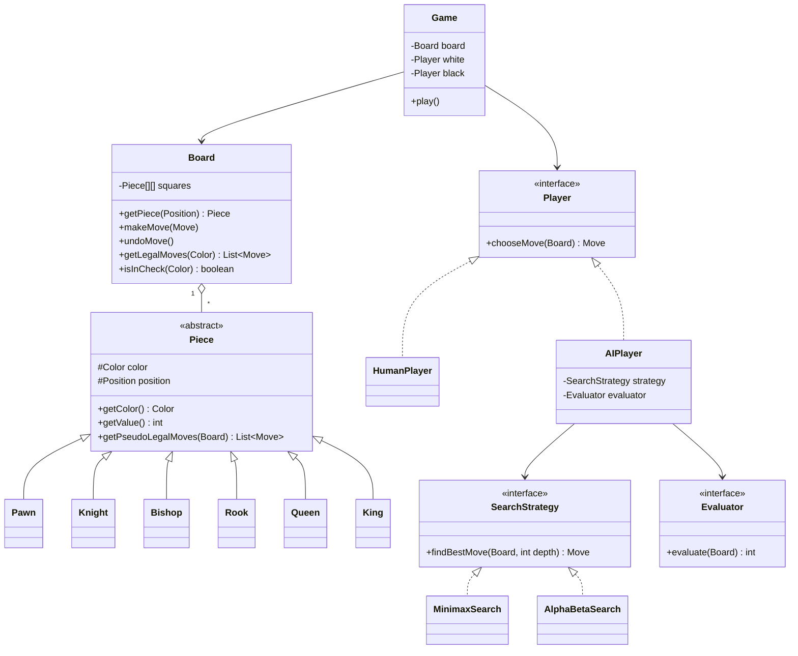

# ♟️ Java Chess AI


Nesne Yönelimli Programlama (NYP) prensipleriyle Java'da sıfırdan yazılmış, **Minimax + Alpha-Beta Pruning** algoritmalarını kullanan bir yapay zekâ rakibe sahip satranç oyunu.

Bu proje iki amaca hizmet ediyor:

1. **NYP'yi gerçek bir problemde uygulamak:** Soyutlama, kalıtım, polimorfizm, kapsülleme ve tasarım desenleri.
2. **Klasik yapay zekâ algoritmalarını anlamak:** Oyun ağacı araması, budama, sezgisel (heuristic) değerlendirme ve arama optimizasyonları.

Hiçbir hazır satranç veya yapay zekâ kütüphanesi kullanılmamıştır; tüm kurallar ve algoritmalar elle yazılmıştır.

---

## 📑 İçindekiler

- [Özellikler](#-özellikler)
- [Yol Haritası](#️-yol-haritası)
- [Mimari ve NYP Tasarımı](#️-mimari-ve-nyp-tasarımı)
- [Kullanılan Tasarım Desenleri](#-kullanılan-tasarım-desenleri)
- [Algoritmalar](#-algoritmalar)
  - [1. Hamle Üretimi](#1-hamle-üretimi-move-generation)
  - [2. Minimax](#2-minimax)
  - [3. Alpha-Beta Budama](#3-alpha-beta-budama-alpha-beta-pruning)
  - [4. Değerlendirme Fonksiyonu](#4-değerlendirme-fonksiyonu-evaluation-function)
  - [5. Hamle Sıralama](#5-hamle-sıralama-move-ordering)
  - [6. Kademeli Derinleştirme](#6-kademeli-derinleştirme-iterative-deepening)
  - [7. Sessizlik Araması](#7-sessizlik-araması-quiescence-search)
  - [8. Transpozisyon Tablosu ve Zobrist Hashing](#8-transpozisyon-tablosu-ve-zobrist-hashing)
- [Kurulum ve Çalıştırma](#-kurulum-ve-çalıştırma)
- [Testler ve Perft Doğrulaması](#-testler-ve-perft-doğrulaması)
- [Proje Yapısı](#-proje-yapısı)
- [Kaynaklar](#-kaynaklar)

---

## ✨ Özellikler

- Tüm satranç kuralları: rok (castling), geçerken alma (en passant), piyon terfisi (promotion), şah, şah mat ve pat
- İnsana karşı yapay zekâ ve yapay zekâya karşı yapay zekâ modları
- Ayarlanabilir zorluk seviyesi (arama derinliği)
- Hamle geri alma (undo)
- Konsol arayüzü, ardından JavaFX grafik arayüzü
- JUnit birim testleri ve perft ile hamle üretimi doğrulaması

## 🗺️ Yol Haritası

**Aşama 1 — Oyun Motoru**
- [ ] `Position`, `Move`, `Color` temel sınıfları
- [ ] Soyut `Piece` sınıfı ve 6 taş türü
- [ ] `Board` sınıfı ve başlangıç dizilimi
- [ ] Taşların temel hamle kuralları
- [ ] Şah kontrolü ve yasal hamle filtresi
- [ ] Özel hamleler: rok, geçerken alma, terfi
- [ ] Oyun sonu tespiti: şah mat, pat
- [ ] Konsoldan iki kişilik oyun

**Aşama 2 — Yapay Zekâ**
- [ ] `Player` arayüzü, `HumanPlayer` ve `AIPlayer`
- [ ] Malzeme tabanlı değerlendirme fonksiyonu
- [ ] Minimax
- [ ] Alpha-Beta budama
- [ ] Taş-kare tabloları (piece-square tables)
- [ ] Hamle sıralama (MVV-LVA)

**Aşama 3 — İleri Seviye**
- [ ] Kademeli derinleştirme ve zaman sınırı
- [ ] Sessizlik araması
- [ ] Zobrist hashing ve transpozisyon tablosu
- [ ] JavaFX arayüzü
- [ ] PGN/FEN ile oyun kaydetme ve yükleme

---

## 🏛️ Mimari ve NYP Tasarımı

Proje iki ana katmandan oluşur: **oyun motoru** (kurallar) ve **yapay zekâ** (karar verme). Yapay zekâ, oyun motorunun iç detaylarını bilmez; yalnızca açık arayüzleri (`getLegalMoves()`, `makeMove()`, `undoMove()`) kullanır. Bu ayrım, NYP'deki **gevşek bağlılık (loose coupling)** ilkesinin doğrudan bir örneğidir.



### NYP kavramlarının projedeki karşılıkları

| Kavram | Projedeki Karşılığı |
|---|---|
| **Soyutlama** | `Piece` soyut sınıfı "hamle üretebilen bir taş" kavramını tanımlar, ama nasıl hamle ürettiğini alt sınıflara bırakır. |
| **Kalıtım** | `Pawn`, `Knight`, `Queen` vb. ortak alanları (renk, konum) ve davranışları `Piece`'ten devralır. |
| **Polimorfizm** | `for (Piece p : pieces) p.getPseudoLegalMoves(board)` çağrısı, taşın türünü bilmeden doğru kuralı çalıştırır. `Player` arayüzü sayesinde `Game` sınıfı insanla da yapay zekâyla da aynı şekilde çalışır. |
| **Kapsülleme** | `Board`, tahtanın iç dizisini (`Piece[][]`) gizler; dışarıdan yalnızca kuralları koruyan metotlarla değiştirilebilir. |
| **Arayüzler** | `Player`, `SearchStrategy`, `Evaluator` — farklı uygulamalar birbirinin yerine takılabilir. |

## 🧩 Kullanılan Tasarım Desenleri

- **Strategy:** `SearchStrategy` ve `Evaluator` arayüzleri sayesinde arama algoritması ve değerlendirme fonksiyonu çalışma anında değiştirilebilir (örneğin kolay seviyede basit değerlendirme, zor seviyede gelişmiş değerlendirme).
- **Command:** Her `Move` nesnesi, tahtaya uygulanabilen ve geri alınabilen bir komuttur. Hamle geçmişi bir yığında (stack) tutulur; bu hem kullanıcının "geri al" özelliğini hem de yapay zekânın arama sırasında hamleleri deneyip geri almasını sağlar.
- **Factory:** `PieceFactory`, FEN gösterimindeki karakterlerden (`'N'`, `'q'` …) doğru taş nesnesini üretir. Piyon terfisinde de kullanılır.
- **Observer:** Grafik arayüz, tahtadaki değişiklikleri dinleyerek kendini günceller; oyun motoru arayüzden haberdar olmak zorunda kalmaz.

---

## 🧠 Algoritmalar

### 1. Hamle Üretimi (Move Generation)

Yapay zekânın kalitesi, hamle üretiminin doğruluğuna bağlıdır. Hamle üretimi iki aşamada yapılır:

**a) Sözde-yasal hamleler (pseudo-legal moves):** Her taş, kendi hareket kuralına göre gidebileceği kareleri listeler; kendi şahının tehlikeye girip girmediğine bakmaz.

| Taş | Hareket Kuralı | Türü |
|---|---|---|
| Piyon | 1 kare ileri, ilk hamlede 2 kare, çapraz alma | Özel |
| At | "L" şeklinde 8 yön, üzerinden atlayabilir | Atlayan (leaper) |
| Fil | Çaprazlarda engel olana kadar | Kayan (slider) |
| Kale | Yatay ve dikeyde engel olana kadar | Kayan (slider) |
| Vezir | Fil + kale | Kayan (slider) |
| Şah | 8 yönde 1 kare | Atlayan (leaper) |

Kayan taşlar için ortak bir yardımcı metot yazılır: verilen yön vektörlerinde (`{dx, dy}`) tahta dışına çıkana veya bir taşa çarpana kadar ilerlenir. Fil, kale ve vezir bu metodu yalnızca farklı yön listeleriyle çağırır. Bu, kod tekrarını önleyen güzel bir kalıtım örneğidir.

**b) Yasal hamleler (legal moves):** Her sözde-yasal hamle tahtada denenir; hamleden sonra kendi şah tehdit altındaysa hamle elenir, sonra geri alınır.

```text
function getLegalMoves(board, color):
    legal = []
    for move in getPseudoLegalMoves(board, color):
        board.makeMove(move)
        if not board.isInCheck(color):
            legal.add(move)
        board.undoMove()
    return legal
```

**Oyun sonu:** Yasal hamle kalmamışsa, şah tehdit altındaysa **şah mat**, değilse **pat** (beraberlik).

**Özel hamleler:**
- **Rok:** Şah ve ilgili kale hiç oynamamış olmalı, aradaki kareler boş olmalı, şah tehdit altında olmamalı ve geçeceği kareler saldırı altında olmamalı.
- **Geçerken alma:** Rakip piyon bir önceki hamlede iki kare ilerleyip piyonumuzun yanına geldiyse, onu çapraz giderek alabiliriz. Bu yüzden tahta "geçerken alma hedef karesini" hatırlamalıdır.
- **Terfi:** Son sıraya ulaşan piyon vezir, kale, fil veya ata dönüşür.

---

### 2. Minimax

Satranç, iki oyunculu, **sıfır toplamlı** (birinin kazancı diğerinin kaybı) ve **tam bilgili** (her şey tahtada görünür) bir oyundur. Bu tür oyunlarda en iyi hamleyi bulmanın temel yöntemi Minimax'tır.

**Fikir:** Olası tüm hamleleri belirli bir derinliğe kadar bir **oyun ağacı** olarak düşünürüz. Beyaz puanı **maksimize** etmeye, siyah ise **minimize** etmeye çalışır. Her oyuncunun rakibin de en iyi hamleyi yapacağını varsayarak seçim yaptığı kabul edilir.

```text
              Beyaz (MAX)
             /     |     \
        Siyah    Siyah   Siyah     (MIN)
        / \      / \      / \
       3   5    2   9    1   7     ← yaprak değerlendirmeleri

Siyah her dalda en küçüğü seçer:   3      2      1
Beyaz bunların en büyüğünü seçer:  3  → ilk hamle oynanır
```

**Sözde kod:**

```text
function minimax(board, depth, maximizingPlayer):
    if depth == 0 or game is over:
        return evaluate(board)

    if maximizingPlayer:
        best = -∞
        for move in board.getLegalMoves(WHITE):
            board.makeMove(move)
            best = max(best, minimax(board, depth - 1, false))
            board.undoMove()
        return best
    else:
        best = +∞
        for move in board.getLegalMoves(BLACK):
            board.makeMove(move)
            best = min(best, minimax(board, depth - 1, true))
            board.undoMove()
        return best
```

**Karmaşıklık:** Satrançta bir pozisyonda ortalama yaklaşık **35** yasal hamle vardır (dallanma faktörü *b*). *d* derinliğe kadar arama **O(b^d)** düğüm inceler:

| Derinlik | Yaklaşık düğüm sayısı |
|---|---|
| 2 | ~1.200 |
| 4 | ~1.500.000 |
| 6 | ~1.800.000.000 |

Bu üstel büyüme yüzünden saf Minimax, birkaç hamleden daha derine bakamaz. Çözüm: budama.

**Negamax varyantı:** Sıfır toplamlı oyunlarda `max(a, b) = -min(-a, -b)` olduğu için iki dal tek fonksiyonda birleştirilebilir. Değerlendirme her zaman "sırası gelen oyuncunun bakış açısından" yapılır ve alt düğümün sonucu eksiyle çarpılır. Kod daha kısa ve hatasız olur; proje ilerledikçe bu forma geçilecektir.

---

### 3. Alpha-Beta Budama (Alpha-Beta Pruning)

Alpha-Beta, Minimax ile **tamamen aynı sonucu** verir ama sonucu etkilemeyeceği kesin olan dalları hiç incelemez.

İki sınır taşınır:
- **α (alpha):** MAX oyuncusunun şimdiye kadar **garanti ettiği** en iyi değer (alt sınır).
- **β (beta):** MIN oyuncusunun şimdiye kadar **garanti ettiği** en iyi değer (üst sınır).

Bir düğümde **α ≥ β** olduğu anda, o dalın geri kalanı incelenmez, çünkü üst seviyedeki oyuncu bu dala zaten hiçbir zaman izin vermeyecektir.

**Sezgisel örnek:** Beyaz, ilk hamlesinin en az **3** puan getirdiğini biliyor (α = 3). İkinci hamleyi incelerken siyahın ilk cevabının **2** puan getirdiğini görüyor. Siyah bu dalda en fazla 2'ye izin vereceğine göre, beyaz için bu dal 3'ten kötü; siyahın diğer cevaplarına bakmaya gerek yok. ✂️

```text
function alphaBeta(board, depth, alpha, beta, maximizingPlayer):
    if depth == 0 or game is over:
        return evaluate(board)

    if maximizingPlayer:
        value = -∞
        for move in orderMoves(board.getLegalMoves(WHITE)):
            board.makeMove(move)
            value = max(value, alphaBeta(board, depth - 1, alpha, beta, false))
            board.undoMove()
            alpha = max(alpha, value)
            if alpha >= beta:
                break          // beta kesmesi
        return value
    else:
        value = +∞
        for move in orderMoves(board.getLegalMoves(BLACK)):
            board.makeMove(move)
            value = min(value, alphaBeta(board, depth - 1, alpha, beta, true))
            board.undoMove()
            beta = min(beta, value)
            if alpha >= beta:
                break          // alpha kesmesi
        return value

// İlk çağrı:
alphaBeta(board, depth, -∞, +∞, true)
```

**Karmaşıklık:**
- En kötü durum (hamleler kötü sıralanmış): **O(b^d)**, Minimax ile aynı.
- En iyi durum (en iyi hamleler önce): **O(b^(d/2))**. Yani aynı sürede **yaklaşık iki kat derinliğe** bakılabilir. Bu yüzden hamle sıralaması (bölüm 5) çok önemlidir.

**Mat skorları:** Şah mat bulunduğunda çok büyük bir değer döndürülür (ör. `MATE = 100000`). Daha hızlı matı tercih etmek için kalan derinlik de eklenir: `return -(MATE + depth)` (mat edilen taraf için). Pat durumunda `0` döndürülür.

---

### 4. Değerlendirme Fonksiyonu (Evaluation Function)

Arama ağacının yapraklarında oyun bitmediği için pozisyonun "ne kadar iyi" olduğunu tahmin eden bir **sezgisel (heuristic) fonksiyon** gerekir. Pozitif değer beyazın, negatif değer siyahın üstün olduğu anlamına gelir. Değerler **centipawn** (piyonun yüzde biri) cinsindendir.

**a) Malzeme (material):** En temel ve en etkili bileşen.

| Taş | Değer |
|---|---|
| Piyon | 100 |
| At | 320 |
| Fil | 330 |
| Kale | 500 |
| Vezir | 900 |
| Şah | 20000 |

```text
material = Σ(beyaz taş değerleri) − Σ(siyah taş değerleri)
```

**b) Taş-kare tabloları (piece-square tables):** Her taş türü için 8×8'lik bir tablo, taşın bulunduğu kareye göre bonus veya ceza verir. Örneğin:
- Atlar merkezde güçlüdür, kenarda zayıftır ("kenardaki at kederli at").
- Piyonlar ilerledikçe değerlenir.
- Şah, oyun ortasında rok yapmış ve korunaklı köşede durmalıdır; oyun sonunda ise merkeze gelmelidir.

Siyah taşlar için aynı tablo dikey olarak aynalanarak kullanılır.

**c) Ek terimler (ileride):**
- **Hareketlilik (mobility):** Yasal hamle sayısı farkı.
- **Piyon yapısı:** Katlanmış, izole ve geçer piyonlar.
- **Şah güvenliği:** Şahın önündeki piyon kalkanı.
- **Fil çifti bonusu.**

```text
evaluate(board) = material + pieceSquareScore + mobility * w1 + ...
```

Değerlendirme fonksiyonu `Evaluator` arayüzünün arkasında olduğu için, farklı sürümler (`MaterialEvaluator`, `PositionalEvaluator`) arama koduna dokunmadan değiştirilebilir.

---

### 5. Hamle Sıralama (Move Ordering)

Alpha-Beta'nın verimi, iyi hamlelerin **önce** denenmesine bağlıdır. Basit ama etkili kurallar:

1. **Alma hamleleri önce,** **MVV-LVA** (Most Valuable Victim – Least Valuable Attacker) sırasıyla: değerli taşı ucuz taşla almak önce denenir. Örneğin "piyon vezir alır" hamlesi, "vezir piyon alır" hamlesinden önce gelir.
2. **Terfi hamleleri.**
3. **Önceki aramada en iyi bulunan hamle** (kademeli derinleştirme ile birlikte).
4. **Killer hamleler:** Aynı derinlikte başka dallarda kesme yaptırmış sessiz hamleler.
5. Geri kalan sessiz hamleler.

```text
score(move) = 10 * value(victim) − value(attacker)   // alma hamleleri için
```

---

### 6. Kademeli Derinleştirme (Iterative Deepening)

Sabit bir derinlik yerine önce derinlik 1, sonra 2, 3… şeklinde arama yapılır ve zaman dolduğunda son tamamlanan derinliğin sonucu kullanılır.

```text
function iterativeDeepening(board, timeLimit):
    bestMove = null
    for depth = 1 to MAX_DEPTH:
        if time is up: break
        bestMove = alphaBetaRoot(board, depth, previousBest = bestMove)
    return bestMove
```

Sığ aramaları tekrar yapmak israf gibi görünse de, ağaç üstel büyüdüğü için toplam maliyete katkıları küçüktür. Üstelik bir önceki derinliğin en iyi hamlesini ilk sırada denemek, Alpha-Beta'yı ciddi şekilde hızlandırır. Bu sayede yapay zekâ "derinlik" yerine "saniye" ile ayarlanabilir.

---

### 7. Sessizlik Araması (Quiescence Search)

**Ufuk etkisi (horizon effect):** Arama derinliği tam bir alma hamlesinde biterse, yapay zekâ "veziri aldım, +900!" diye düşünür ama bir sonraki hamlede veziriyle birlikte kendi taşının da gideceğini göremez.

**Çözüm:** Derinlik 0'a ulaşınca hemen değerlendirme yapmak yerine, pozisyon "sakinleşene" kadar **yalnızca alma hamleleri** aranır.

```text
function quiescence(board, alpha, beta):
    standPat = evaluate(board)          // hiç almadan durma seçeneği
    if standPat >= beta: return beta
    alpha = max(alpha, standPat)

    for capture in orderMoves(board.getCaptures()):
        board.makeMove(capture)
        score = -quiescence(board, -beta, -alpha)   // negamax formu
        board.undoMove()
        if score >= beta: return beta
        alpha = max(alpha, score)
    return alpha
```

---

### 8. Transpozisyon Tablosu ve Zobrist Hashing

Farklı hamle sıralarıyla aynı pozisyona ulaşılabilir (**transpozisyon**). Örneğin 1.Af3 Af6 2.Ac3 ile 1.Ac3 Af6 2.Af3 aynı pozisyondur. Aynı pozisyonu tekrar tekrar aramamak için sonuçlar bir hash tablosunda saklanır.

**Zobrist hashing:** Her (taş türü, renk, kare) üçlüsü için bir kez rastgele 64 bitlik sayı üretilir (12 × 64 sayı), ayrıca sıra, rok hakları ve geçerken alma için birkaç sayı daha. Pozisyonun hash değeri, tahtadaki taşlara karşılık gelen sayıların **XOR**'udur.

XOR'un güzel özelliği sayesinde hash her hamlede sıfırdan hesaplanmaz, **artımlı (incremental)** güncellenir:

```text
// At e2'den f3'e giderse:
hash ^= ZOBRIST[KNIGHT][WHITE][e2]   // eski kareden çıkar
hash ^= ZOBRIST[KNIGHT][WHITE][f3]   // yeni kareye ekle
hash ^= ZOBRIST_SIDE_TO_MOVE         // sıra değişti
```

Tabloda her pozisyon için saklananlar: hash, arama derinliği, skor, skor türü (tam değer / alt sınır / üst sınır) ve en iyi hamle. Aynı yapı, **üç kez tekrar** beraberlik kuralını tespit etmek için de kullanılır.

---

## 🚀 Kurulum ve Çalıştırma

**Gereksinimler**
- Java 21 (JDK)
- Maven 3.9+

```bash
git clone https://github.com/BilimKubra/java-chess-ai.git
cd java-chess-ai
mvn compile
mvn exec:java -Dexec.mainClass="com.bilimkubra.chess.App"
```

> ℹ️ Proje geliştirme aşamasındadır; çalıştırma komutları ilerleyen aşamalarda güncellenecektir.

## 🧪 Testler ve Perft Doğrulaması

```bash
mvn test
```

Hamle üretimi hataları, satranç motorlarında en sık ve en zor bulunan hatalardır. Bunları yakalamak için **perft** (performance test) kullanılır: belirli bir derinlikte oluşabilecek tüm pozisyonlar sayılır ve bilinen doğru değerlerle karşılaştırılır.

**Başlangıç pozisyonu için doğru perft değerleri:**

| Derinlik | Pozisyon Sayısı |
|---|---|
| 1 | 20 |
| 2 | 400 |
| 3 | 8.902 |
| 4 | 197.281 |
| 5 | 4.865.609 |

```text
function perft(board, depth):
    if depth == 0: return 1
    count = 0
    for move in board.getLegalMoves(board.sideToMove):
        board.makeMove(move)
        count += perft(board, depth - 1)
        board.undoMove()
    return count
```

Sayılar tutmuyorsa, hamle üretiminde (genellikle rok, geçerken alma veya terfide) bir hata vardır.

## 📁 Proje Yapısı

```text
java-chess-ai/
├── pom.xml
├── README.md
└── src/
    ├── main/java/com/bilimkubra/chess/
    │   ├── App.java
    │   ├── core/          # Board, Position, Move, Color, Game
    │   ├── pieces/        # Piece, Pawn, Knight, Bishop, Rook, Queen, King, PieceFactory
    │   ├── player/        # Player, HumanPlayer, AIPlayer
    │   ├── ai/            # SearchStrategy, MinimaxSearch, AlphaBetaSearch, Evaluator
    │   └── ui/            # ConsoleUI, (ileride) JavaFX
    └── test/java/com/bilimkubra/chess/
        ├── pieces/        # Taş hamle testleri
        ├── core/          # Board ve perft testleri
        └── ai/            # Arama ve değerlendirme testleri
```

## 📚 Kaynaklar

- [Chess Programming Wiki](https://www.chessprogramming.org/) — satranç motoru geliştirmenin temel başvuru kaynağı
- [Minimax — Wikipedia](https://en.wikipedia.org/wiki/Minimax)
- [Alpha-Beta Pruning — Wikipedia](https://en.wikipedia.org/wiki/Alpha%E2%80%93beta_pruning)
- [Simplified Evaluation Function — Chess Programming Wiki](https://www.chessprogramming.org/Simplified_Evaluation_Function)
- [Perft Results — Chess Programming Wiki](https://www.chessprogramming.org/Perft_Results)
- Russell & Norvig, *Artificial Intelligence: A Modern Approach* — Bölüm: Adversarial Search

## 📄 Lisans

Bu proje MIT lisansı ile lisanslanmıştır.

---

👩‍💻 Geliştiren: [BilimKubra](https://github.com/BilimKubra)
